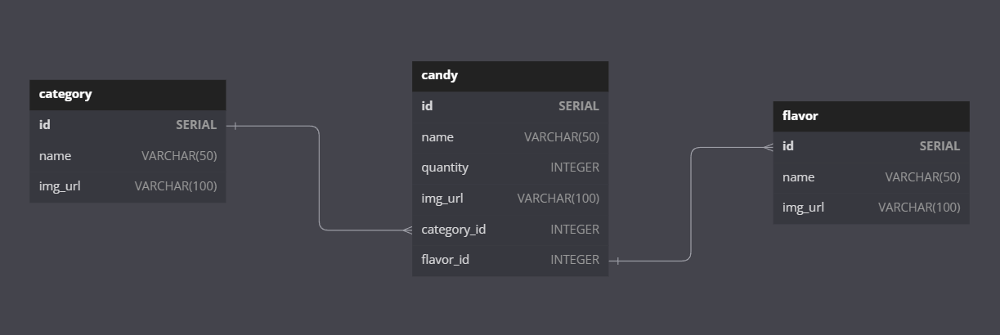

# Candy Store Project

Welcome to our Candy Store project! This is a web application that allows you to add candies that you want to sell on the site, and to buy candy if you are looking for some! All you have to do is browse the chose the ones you like the most!

# Installation

1. Clone the project repository to your local machine.
2. Open a terminal and navigate to the project directory.
3. Run npm install to install the required dependencies.
4. Create a .env file in the root directory of the project and add the following environment variables:
5. PORT - the port number to run the server on (default is 5000)
6. Run npm run dev to start the server using Nodemon.

## or visit out website on [Demo]()

 

# Technologies

This project use many techonologes such as :

1. node.js: the back-end side of this project is set using node.js
2. express.js: the server and routers are made using express.js
3. npm modules: this project uses many moducles such as nodemon, such as cross-end, dotenc, pg, express, jest, joi, and supertest.
4. postgress database
5. HTML, CSS, and JS
6. Server validation 
7. JWT Authentication
 

# Database Setup

## 1. The Schema:

as you can see in the iamge, there are three tables. and relaction between the talbes is always, one-to-many. the candy table, contains

# Usage

To use our Candy Store, follow these steps:

1. Open a web browser and navigate to http://localhost:5000/ or visit our website.
2. If you are looknig to sell some candy, Click the "Add Candy" button to add a new candy to the store.
3. Enter the details of the candy, including its name, image, flavor, category, and quantity.
4. Click the "Submit" button to add the candy to the store.
5. You can view the list of candies on the homepage.
6. If you are looking for some sepecif category(such as Licorice) or flavor (such as chocolate), you will find a category and a flavor buttons in the top-right corner of the home page. Click them and choose what you want.

# Contributing

If you'd like to contribute to the project, you can fork the repository, make your changes, and submit a pull request.

# Contributors

1. Abeer Ayyad
2. Haitham Abu Lamdi
3. Mohammed Rabee Albatrawi
